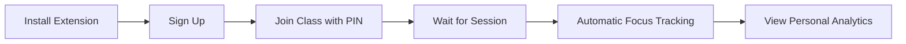
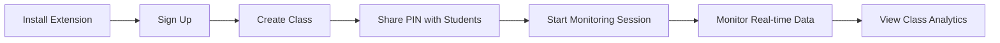

# Focus Monitor Chrome Extension 🎯

A comprehensive focus monitoring system for online learning environments that uses computer vision to track student attention during virtual classes.

## 📋 Table of Contents

- [Overview](#overview)
- [Features](#features)
- [System Requirements](#system-requirements)
- [Installation](#installation)
- [Quick Start Guide](#quick-start-guide)
- [Usage](#usage)
- [Architecture](#architecture)
- [API Documentation](#api-documentation)
- [Troubleshooting](#troubleshooting)
- [Contributing](#contributing)
- [License](#license)

## 🔍 Overview

Focus Monitor is an educational technology solution that helps lecturers monitor student engagement in online classes through automated focus tracking. The system uses MediaPipe and OpenCV for accurate face detection and eye tracking, providing real-time analytics on student attention levels.

### Key Components
- **Chrome Extension**: Student and lecturer interfaces
- **Flask Backend**: Computer vision processing server
- **PostgreSQL Database**: Data storage via Supabase
- **Analytics Dashboard**: Real-time focus visualization

## ✨ Features

### For Students
- ✅ Automatic session detection when lecturer starts monitoring
- ✅ Real-time focus tracking with accuracy percentage
- ✅ Personal focus history and performance analytics
- ✅ Simple class joining via 6-digit PIN codes
- ✅ Background monitoring without disrupting workflow

### For Lecturers
- ✅ Create and manage multiple classes
- ✅ Real-time monitoring of all enrolled students
- ✅ Class-wide performance analytics and trends
- ✅ Individual student focus reports
- ✅ Session management with start/stop controls

### Technical Features
- ✅ MediaPipe face mesh for accurate detection
- ✅ Eye Aspect Ratio (EAR) calculation for focus analysis
- ✅ Multi-user concurrent session support
- ✅ Docker containerized deployment
- ✅ Secure authentication and data storage

## 💻 System Requirements

### Minimum Requirements
- **Browser**: Google Chrome 88+ or Microsoft Edge 88+
- **Operating System**: Windows 10+, macOS 10.14+, or Linux Ubuntu 18.04+
- **RAM**: 4GB minimum, 8GB recommended
- **Internet**: Stable broadband connection
- **Hardware**: Webcam with 720p resolution

### Development Requirements
- **Python**: 3.9+
- **Node.js**: 14+ (for development tools)
- **Docker**: Latest version for deployment

## 🚀 Installation

### Method 1: Manual Installation (Recommended for Testing)

#### Step 1: Download the Extension
```bash
git clone https://github.com/yourusername/focus-monitor-extension.git
cd focus-monitor-extension
```

#### Step 2: Install Chrome Extension
1. Open Google Chrome
2. Navigate to `chrome://extensions/`
3. Enable "Developer mode" (toggle in top-right corner)
4. Click "Load unpacked"
5. Select the `Focus-Monitor-Extension` folder
6. Pin the extension to your toolbar for easy access

#### Step 3: Verify Installation
1. Look for the Focus Monitor icon in Chrome toolbar
2. Click the icon to open the extension popup
3. You should see the login/signup interface

### Method 2: Backend Setup (For Development)

#### Prerequisites
```bash
# Install Python dependencies
pip install -r requirements.txt

# Install system dependencies (Ubuntu/Debian)
sudo apt-get update
sudo apt-get install libglib2.0-0 libsm6 libxext6 libxrender-dev libgomp1
```

#### Environment Configuration
Create a `.env` file in the backend directory:
```env
user=your_db_user
password=your_db_password
host=your_supabase_host
port=5432
dbname=postgres
```

#### Run Backend Server
```bash
python app.py
```
Server will start at `http://localhost:5050`

### Method 3: Docker Deployment
```bash
# Build Docker image
docker build -t focus-monitor-backend .

# Run container
docker run -p 5050:5050 --env-file .env focus-monitor-backend
```

## 🎯 Quick Start Guide

### For Students

1. **Install Extension** (see installation steps above)
2. **Create Account**:
   - Click Focus Monitor icon
   - Select "Sign Up"
   - Enter: Name, Email, Matric Number
   - Choose "Student" role
3. **Join Class**:
   - Get 6-digit PIN from lecturer
   - Enter PIN in "Enter Class PIN" field
   - Click "Join Class"
4. **Automatic Monitoring**:
   - Wait for lecturer to start session
   - Extension automatically begins tracking when session starts
   - View your focus percentage in real-time

### For Lecturers

1. **Install Extension** (see installation steps above)
2. **Create Account**:
   - Click Focus Monitor icon
   - Select "Sign Up"
   - Enter: Name, Email, Staff ID
   - Choose "Lecturer" role
3. **Create Class**:
   - Click "Create New Class"
   - Enter class name and schedule
   - Note the generated 6-digit PIN
   - Share PIN with students
4. **Start Monitoring**:
   - Ensure students have joined using PIN
   - Click "Start Session"
   - Monitor real-time student focus data
   - Click "Stop Session" when finished

## 📖 Usage

### Student Workflow


### Lecturer Workflow


### Focus Detection Levels
- **🟢 Focused (80-100%)**: Eyes open, looking at screen center
- **🟡 Moderate (50-79%)**: Eyes open, slightly off-center gaze
- **🔴 Distracted (<50%)**: Eyes closed, looking away, or no face detected

## 🏗️ Architecture

### System Overview
```
┌─────────────────┐    ┌──────────────────┐    ┌─────────────────┐
│   Chrome        │    │   Flask Backend  │    │   PostgreSQL   │
│   Extension     │◄──►│   (Python)       │◄──►│   (Supabase)    │
│                 │    │                  │    │                 │
│ • Student UI    │    │ • MediaPipe CV   │    │ • User Data     │
│ • Lecturer UI   │    │ • Focus Analysis │    │ • Focus Logs    │
│ • Auto Capture  │    │ • API Endpoints  │    │ • Class Info    │
└─────────────────┘    └──────────────────┘    └─────────────────┘
```

### Tech Stack
- **Frontend**: HTML5, CSS3, JavaScript (Chrome Extension APIs)
- **Backend**: Python Flask, MediaPipe, OpenCV
- **Database**: PostgreSQL (Supabase)
- **Deployment**: Docker, Render Cloud Platform
- **Computer Vision**: MediaPipe Face Mesh, Eye Aspect Ratio (EAR)

## 📡 API Documentation

### Main Endpoints

#### Upload Screenshot
```http
POST /api/upload
Content-Type: multipart/form-data

Parameters:
- screenshot: Image file
- user_id: UUID string

Response:
{
  "status": "Focused|Distracted|Partially Focused",
  "accuracy": 85.5,
  "timestamp": "20241201_143022",
  "details": "Face detected, EAR=(0.25, 0.23)"
}
```

#### Get Focus History
```http
GET /api/focus/history

Response:
[
  {
    "user_name": "John Doe",
    "status": "Focused",
    "accuracy": 92.3,
    "timestamp": "20241201_143022"
  }
]
```

#### Get Grouped Analytics
```http
GET /api/focus/grouped-history

Response:
{
  "John Doe": {
    "2024-12-01": {
      "14:30": 92.3,
      "14:40": 88.7
    }
  }
}
```

## 🔧 Troubleshooting

### Common Issues

#### Extension Won't Install
- **Issue**: Extension fails to load
- **Solution**: 
  1. Ensure Developer Mode is enabled
  2. Check that `manifest.json` exists in root folder
  3. Try reloading the extension

#### Focus Detection Inaccurate
- **Issue**: Wrong focus readings
- **Solutions**:
  1. Ensure good lighting on face
  2. Position camera at eye level
  3. Keep face clearly visible to webcam
  4. Avoid reflective glasses if possible

#### Session Won't Start
- **Issue**: Students can't detect active session
- **Solutions**:
  1. Check internet connection
  2. Verify students joined correct class (PIN)
  3. Ensure lecturer clicked "Start Session"
  4. Wait up to 10 seconds for auto-detection

#### Backend Connection Failed
- **Issue**: Screenshots not processing
- **Solutions**:
  1. Check if backend server is running
  2. Verify API endpoint URL in extension
  3. Check firewall/network restrictions
  4. Ensure database connection is working

### Performance Optimization

#### For Better Accuracy
- Use consistent lighting
- Position webcam at eye level
- Maintain 18-24 inches from camera
- Avoid busy backgrounds

#### For Better Performance
- Close unnecessary browser tabs
- Ensure stable internet connection
- Use Chrome (recommended over other browsers)
- Keep extension updated

## 🔐 Privacy & Security

- Screenshots are processed immediately and not permanently stored
- User data is encrypted in transit and at rest
- No personal data is shared with third parties
- Users can delete their data at any time
- Compliance with educational privacy standards

## 🤝 Contributing

We welcome contributions! Please see our [Contributing Guidelines](CONTRIBUTING.md) for details.

### Development Setup
1. Fork the repository
2. Create a feature branch: `git checkout -b feature-name`
3. Make your changes and test thoroughly
4. Submit a pull request with detailed description

### Reporting Issues
Please use GitHub Issues to report bugs or request features. Include:
- Detailed description of the issue
- Steps to reproduce
- Expected vs actual behavior
- Browser and OS information
- Screenshots if applicable

## 📄 License

This project is licensed under the MIT License - see the [LICENSE](LICENSE) file for details.

## 📞 Support

- **Documentation**: [Wiki](https://github.com/yourusername/focus-monitor/wiki)
- **Issues**: [GitHub Issues](https://github.com/yourusername/focus-monitor/issues)
- **Email**: support@focusmonitor.edu
- **Discord**: [Join our community](https://discord.gg/focusmonitor)

## 🙏 Acknowledgments

- **MediaPipe Team** for excellent face detection library
- **OpenCV Community** for computer vision tools
- **Supabase** for database infrastructure
- **Contributors** who helped improve this project

---

**⭐ Star this repository if you find it helpful!**

*Focus Monitor - Enhancing Online Learning Through Intelligent Attention Tracking*
